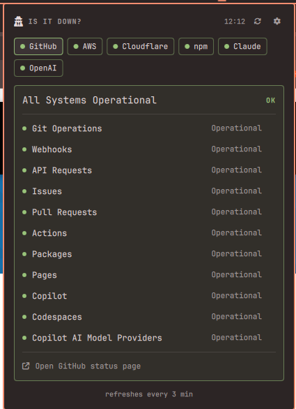

# Is It Down?

*Is it me or is it down?* Watch the status pages of services you depend on
from a detective icon in the Omarchy bar.



## Features

- Detective icon turns yellow/red with a count badge when a watched service
  reports trouble.
- Panel with one tab per service (GitHub, AWS, Cloudflare, npm, Claude,
  OpenAI, Vercel, PyPI, Discord, Netlify), colored green/yellow/red.
- Per-service detail: overall status, active incidents, component health.
- Built-in settings (⚙): toggle services on/off, then drill into a service to
  enable/disable its AWS regions or components — with a filter and
  enable/disable-all buttons.
- Follows your Omarchy theme; red comes from the theme's urgent color.

## Requirements

- Omarchy (Quattro shell) with a bar. Uses only stock tools (`curl`, `jq`,
  `iconv`).

## Install

```sh
omarchy plugin add https://github.com/Bottelet/omarchy-is-it-down.git --enable
omarchy bar put bottelet.is-it-down --after omarchy.weather
```

## Usage

- Left-click the detective to open the panel; middle-click to force a refresh.
- Click a tab to see that service; the "Open … status page" link at the bottom
  of the card opens the real status page in your browser.
- Hover a component row and click ✕ to mute it. Manage everything under ⚙.
- Unreachable status pages show "maybe it's you" and don't badge the icon.

## Add a service

Any Statuspage-powered site works without code changes: add a
`customServices` entry to the plugin's settings in
`~/.config/omarchy/shell.json`:

```json
{ "id": "bottelet.is-it-down",
  "customServices": [
    { "key": "tailscale", "name": "Tailscale",
      "api": "https://status.tailscale.com/api/v2/summary.json" }
  ] }
```

It appears in ⚙ like any built-in. Components and AWS regions are discovered
live from the services themselves, so new ones show up automatically.

## Remove

```sh
omarchy plugin remove bottelet.is-it-down
```

Settings live in this plugin's own entry in `~/.config/omarchy/shell.json`;
nothing else is touched.

## License

MIT
