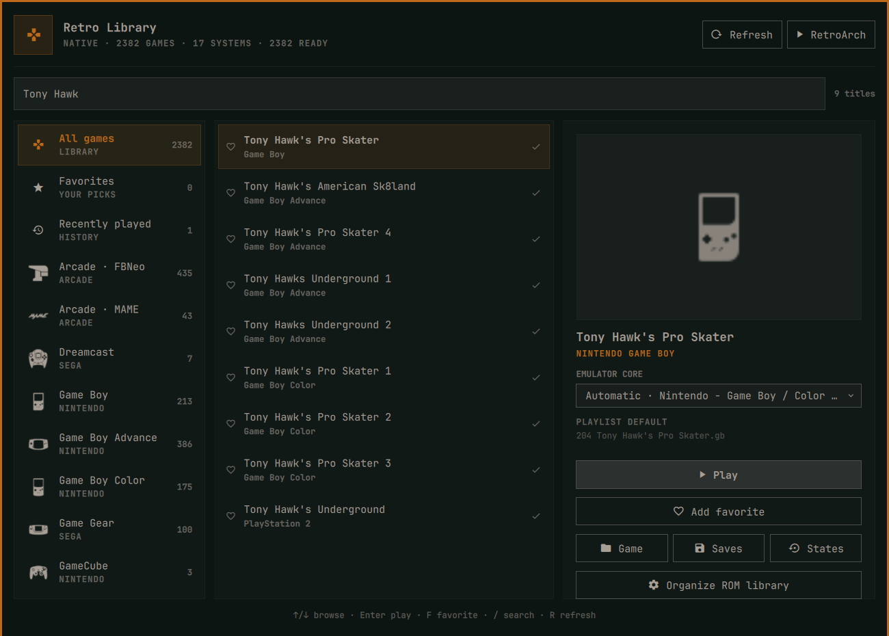

# Retro Library

Retro Library is a local-first Omarchy Quattro bar plugin for browsing and launching an existing RetroArch collection. It reads RetroArch's playlists directly, groups titles by console, uses installed Ozone system icons and local box art, and launches each title with its configured core.



## Features

- Console-sorted library with system-specific RetroArch icons
- Fast search across titles, systems, and cores
- Local box-art preview when RetroArch thumbnails are available
- Direct launch using the playlist's default core
- Per-game overrides limited to compatible installed cores
- Favorites and recently played views
- Shortcuts to the selected game's folder, saves, and save states
- Optional integration with `organizeroms` when that command is installed
- Native-package, Flatpak, Snap-style, and custom/AppImage discovery
- No network requests, telemetry, ROM scanning, or playlist modification

RetroArch remains the source of truth. The plugin never moves ROMs, downloads cores, edits playlists, or changes RetroArch settings.

## Requirements

- Omarchy Quattro
- RetroArch with at least one JSON `.lpl` playlist
- Python 3
- `xdg-open` for folder shortcuts

RetroArch itself, emulator cores, firmware/BIOS files, and game content are external dependencies and are not distributed with this plugin. Core and game compatibility remains the responsibility of the installed RetroArch/core setup.

## Install

```sh
omarchy plugin add https://github.com/dlpwaters/omarchy-retro-library.git --enable
```

The widget defaults to the left bar section. Move it with the normal Omarchy bar command if desired:

```sh
omarchy bar move io.github.dlpwaters.retro-library --section left
```

## Automatic discovery

Retro Library selects the configuration containing the most playlists from these standard locations:

1. `$XDG_CONFIG_HOME/retroarch`
2. `~/.var/app/org.libretro.RetroArch/config/retroarch` (Flatpak)
3. `~/snap/retroarch/current/.config/retroarch`

It then reads `retroarch.cfg` rather than assuming fixed locations for playlists, cores, core metadata, assets, thumbnails, saves, and save states.

Native RetroArch is launched from `PATH`. A detected Flatpak configuration uses `flatpak run org.libretro.RetroArch`. Playlist entries using `DETECT`, archive-member paths such as `game.zip#rom.nes`, and custom absolute content paths are supported.

For Flatpak installations, game folders must already be visible to RetroArch through its normal sandbox permissions. Retro Library never broadens Flatpak filesystem access on the user's behalf.

## Custom installations

For an AppImage, portable build, or unusual configuration location, save an explicit override:

```sh
PLUGIN="$HOME/.config/omarchy/plugins/io.github.dlpwaters.retro-library/retro-library"

"$PLUGIN" configure \
  --config-dir "$HOME/Games/RetroArch/config" \
  --retroarch-command "$HOME/Applications/RetroArch.AppImage"
```

Clear overrides and return to automatic discovery:

```sh
"$PLUGIN" configure --clear
```

Inspect exactly what was detected:

```sh
"$PLUGIN" doctor | python3 -m json.tool
```

Environment variables are also available for non-persistent testing or advanced launchers:

- `RETRO_LIBRARY_CONFIG_DIR`
- `RETRO_LIBRARY_COMMAND`
- `RETRO_LIBRARY_CORE_DIRS`
- `RETRO_LIBRARY_INFO_DIRS`
- `RETRO_LIBRARY_ASSET_DIRS`

Directory-list variables use the normal colon separator.

## Controls

- `Left` / `Right`: move between Systems and ROMs
- `Up` / `Down`: browse the active section
- `Enter`: move from Systems into ROMs, or launch the selected title
- `F`: toggle favorite
- `/`: focus search
- `R`: refresh playlists
- `Escape`: clear search, then close

## Local data and privacy

Favorites, recent history, core overrides, and optional discovery overrides are stored at:

```text
${XDG_STATE_HOME:-~/.local/state}/retro-library/state.json
```

This file stays local. ROM filenames, playlists, thumbnails, save data, and usage history are never uploaded.

## Remove

```sh
omarchy plugin remove io.github.dlpwaters.retro-library
```

Removal leaves RetroArch, ROMs, playlists, saves, and the plugin's small state file untouched. To remove that optional state later:

```sh
gio trash "${XDG_STATE_HOME:-$HOME/.local/state}/retro-library"
```

## Validation

```sh
python3 -m unittest -v tests.test_retro_library
python3 -m py_compile retro_library.py
python3 -m json.tool manifest.json >/dev/null
qmllint -I "$OMARCHY_PATH/shell" BarWidget.qml Panel.qml
omarchy plugin validate .
```

## Licensing

Retro Library's source is MIT licensed. At runtime it can display locally installed Ozone icons from the [RetroArch assets project](https://github.com/libretro/retroarch-assets), which is licensed under CC BY 4.0. The plugin does not redistribute emulator cores, firmware, ROMs, box art, or RetroArch assets.
