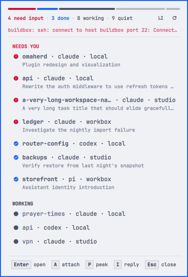
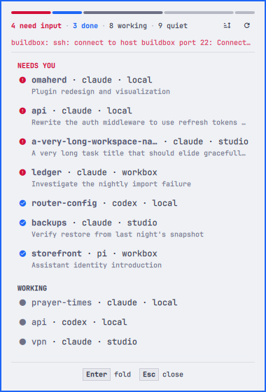
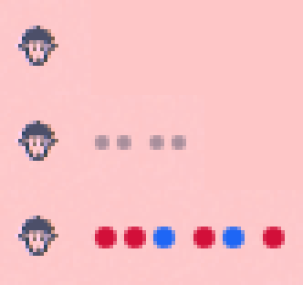
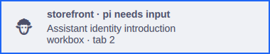
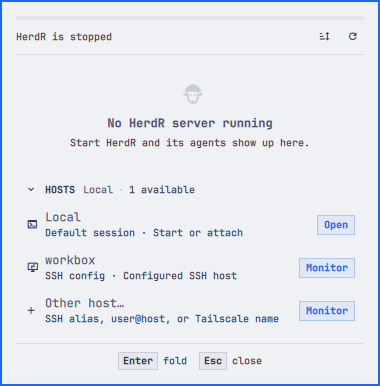

# Omaherd

**Your coding agents, in the Omarchy bar.** Omaherd watches every HerdR
session you care about — this machine and any host you can reach over SSH —
and tells you who needs you, what each agent is doing, and how long it has
waited, with one keypress to the pane.

```bash
omarchy plugin add https://github.com/salemsayed/omaherd.git --enable
```

## Demo


## Screenshots





The bar, with nothing to show, with agents working, and with agents waiting
on you — grouped by machine, never a number:



One notification per agent, replaced as it changes and withdrawn when the
agent moves on; clicking it brings the agent to the front:



Nothing running yet:



## Highlights

- Draws the herd in the bar: one dot per *active* agent beside the sheep —
  small and breathing for working, larger and colored for an agent that needs
  input or finished, grouped by host. No numbers, no badge; quiet agents add
  nothing.
- Opens into a small inbox: a herd meter and one legend line, then whoever
  needs a person first, across every host (or grouped by host — press `G`).
  Quiet agents and the host chooser fold behind one row each, so a glance
  shows only what matters.
- Shows each agent's current task, taken from the title the agent sets, and
  how long it has been in its state.
- Brings any agent to the front with Enter. Locally, the HerdR window is
  raised and switched to that pane. Remotely, the pane is focused on the
  remote server over SSH and the local window showing that session — a
  `herdr --remote` client, an ssh or mosh terminal — is raised. With nothing on
  screen, a terminal attaches to the pane instead.
- Stops monitoring a remote host — or hides a discovered one you will never
  want — with `X` in the panel.
- Shows a quiet pulse while agents are working.
- Keeps one desktop notification per agent that needs input or finished,
  replaces it as the state changes, withdraws it once the agent moves on, and
  brings the agent to the front when clicked.
- Optionally lets you **peek** at an agent's last terminal lines (`P`) and
  **reply** into its pane (`I`) without leaving the panel — off by default,
  because it is the one feature that reads pane output.
- Reads local sessions straight from HerdR's socket (microseconds, no process
  spawn) and falls back to the CLI when a socket is missing.
- Hears about local state changes **instantly**: the repo doubles as a HerdR
  plugin whose event hook pokes the bar the moment an agent is detected or
  changes state, so a blocked agent shows up in well under a second rather
  than on the next poll.
- Discovers named HerdR sessions automatically on each host.
- Automatically offers concrete hosts from `~/.ssh/config`.
- Automatically offers online Linux and macOS computers from Tailscale.
- Adds an in-panel **Other host…** field for an SSH alias, `user@host`, or SSH URI.
- Turns a discovered host into persistent background monitoring with one click.
- Keeps retrying monitored hosts without blocking local status.
- Never opens a terminal, installs HerdR, or restarts HerdR for remote monitoring;
  only Enter or `A` on a remote agent reaches for a terminal.
- Opens or attaches to exact HerdR panes, local or remote, with Enter or a click.
- Uses ordinary OpenSSH aliases and does not store credentials.

The plugin reads HerdR's structured session snapshot. It does not scrape
terminal contents and does not copy agent output into the desktop shell.

## Install

```bash
omarchy plugin add https://github.com/salemsayed/omaherd.git --enable
```

That is the whole install. Nothing is downloaded beyond the repository, no
service is started, and nothing outside the plugin's own bar entry is written
to your configuration. The first poll links Omaherd's HerdR hook for instant
updates (see below); everything else is on demand.

## Remove

```bash
omarchy plugin remove io.github.salemsayed.omaherd --yes
herdr plugin unlink io.github.salemsayed.omaherd    # the instant-updates hook, if it was linked
rm -rf "$XDG_RUNTIME_DIR/omaherd"                    # transient: SSH control sockets, toast ids, hook log
```

Omaherd keeps no other state. Its settings live in Omarchy's `shell.json`
entry for the widget and go with it.

## Requirements

- Omarchy with the Quickshell plugin host.
- HerdR 0.8.0 or newer on every machine you want to monitor (`session.snapshot`
  and `agent focus` are both there). Raising the right *remote* window by its
  title needs HerdR 0.8.2 on the remote, which is when HerdR started keeping
  the outer window title in sync (`ui.window_title`, default
  `{hostname}: {workspace}` — keep that default).
- `python3` (Omarchy ships it) and OpenSSH locally. Optional: `tailscale`,
  for offering online Tailscale machines as hosts to monitor.
- Key-based or `ssh-agent` authentication for background remote checks.

Nothing is bundled or installed by the plugin.
- Optional: `qmllint` for the test suite's QML checks (on Arch it ships with
  `qt6-declarative`).

## Development install

From this checkout:

```bash
plugin_id=io.github.salemsayed.omaherd
mkdir -p ~/.config/omarchy/plugins
ln -s "$PWD" ~/.config/omarchy/plugins/$plugin_id
omarchy-shell shell rescanPlugins
omarchy plugin enable "$plugin_id" --section right --yes
```

After editing QML or `Model.js`, run `omarchy-restart-shell`; the shell caches plugin
components for the life of its process.

See [CONTRIBUTING.md](CONTRIBUTING.md) for the fixture drop-in that drives the
panel from a saved status file, so you can work on a full herd, an offline
host, or a stopped server without arranging one.

## Remote monitoring

Click the sheep in the bar. Omaherd automatically lists concrete aliases from
your OpenSSH config and online Tailscale computers that can run HerdR. Choose
**Monitor**, or select **Other host…** and type an SSH alias, `user@host`, or an address
such as `ssh://user@host:2222` directly in the panel.

That click saves the host under **Omarchy Setup → Plugins → Omaherd → Monitored
remote hosts** and starts polling it immediately. Nothing launches in a terminal.
Monitored hosts are queried concurrently and a disconnected host is retried in
the background without blocking local status.

Background checks share one SSH connection per host through OpenSSH
ControlMaster: the first check opens a master, later checks ride it, and the
control sockets live in `$XDG_RUNTIME_DIR/omaherd/` with `ControlPersist=60`.
Polling every few seconds therefore costs about one handshake a minute per
host, not one per query, and the master goes away shortly after monitoring
stops. Your own `~/.ssh/config` still applies to every connection.

Enter on a remote agent focuses the pane on the remote server and then raises
whatever local window is already showing that session: a `herdr --remote <host>`
client, or an ssh/mosh terminal whose window title ends in HerdR's
`<host>: <workspace>` form. If neither is on screen, Enter falls back to
attaching over `ssh -t` in a new terminal, exactly as `A` does.

OpenSSH remains responsible for users, ports, keys, proxies, and host
verification. Because checks are noninteractive, use key-based or `ssh-agent`
authentication. Omaherd calls the remote machine's existing read-only HerdR
status command, so local and remote HerdR versions do not need to match. It does
not use HerdR's managed remote bridge and cannot replace or restart the remote
server.

## Controls

- Left click: open or close the inbox and choose remote hosts to monitor.
- Middle click: open the local HerdR session.
- Right click: refresh.
- `J` / `K` or arrows: move through agents and hosts.
- Enter or click: bring the selected agent to the front (raise the window
  showing its session and focus its pane, or attach in a terminal when none is
  open); unfold or fold the **QUIET** and **HOSTS** rows; monitor the selected
  remote host, or attach to one already monitored; open the manual host field.
- `A` or middle click: attach to the selected agent in a new terminal (over
  `ssh -t` for a remote host).
- `X`: stop monitoring the selected remote host, or hide a discovered host so
  it is never offered again (the `ignoredHosts` setting; clear it in Omarchy
  Setup to bring them back).
- `P`: peek — show the selected agent's last terminal lines under its row
  (needs **Peek and reply from the panel** turned on). `P` again hides them.
- `I`: reply — type a line and press Enter to send it, followed by Enter, into
  the selected agent's pane (same setting). Works for local and remote agents.
- `G`: switch between grouping by attention and by host.
- `R`: refresh.
- `O`: open HerdR.
- Escape: close.

The `groupBy`, `barHerd`, `notifyOn`, `ignoredHosts`, `peekAndReply`, and
`instantUpdates` settings under **Omarchy Setup → Plugins → Omaherd** hold the
grouping, whether the herd dots show in the bar, which agent events raise a
notification, which discovered hosts stay hidden, whether `P`/`I` are
available, and whether the HerdR hook is linked.

The bar shows at most six dots, only for agents that are working or need
you, the loudest first, grouped by machine with the local one leading. The
counts themselves live in the sheep's tooltip and in the panel.

## Instant updates

Omaherd ships a `herdr-plugin.toml`. With **Instant updates** on (the
default) the bar widget runs `herdr plugin link <plugin dir> --enabled` once,
if the plugin is not already listed. From then on HerdR runs `omaherd-hook` on
`pane.agent_detected`, `pane.agent_status_changed` and `pane.closed`; the hook
does nothing but `omarchy-shell io.github.salemsayed.omaherd poke`, which
triggers a plain poll. Remote hosts are still polled on the interval. Turning
the setting off stops the linking; to remove the hook run
`herdr plugin unlink io.github.salemsayed.omaherd`.

## Notifications

Omaherd raises one toast per agent when it starts needing input (urgent, kept
on screen) or finishes (normal). The toast is replaced in place when the same
agent's state changes again and withdrawn automatically once the agent is no
longer waiting, so the screen never shows a stale ask. The body carries the
agent's current task and where it lives; clicking the toast brings the agent
to the front exactly like Enter in the panel. Notifications go through
`omarchy-notification-send` when available and plain `notify-send` otherwise.

HerdR can raise desktop toasts of its own (`[ui.toast] delivery = "system"` or
`"terminal"` in `~/.config/herdr/config.toml`). Its default is `off`; keep it
there, or set Omaherd's **Notify when an agent** to **Off**, so an agent's ask
does not arrive twice.

IPC: `omarchy-shell io.github.salemsayed.omaherd <open|close|toggle|refresh|poke|launch|status>`,
plus `monitor <host>` and `unmonitor <host>`. `refresh` also rediscovers hosts;
`poke` is the plain poll the HerdR hook uses.

## Tests

```bash
./tests/run
omarchy plugin validate .
```

`tests/run` covers the `Model.js` and IPC unit tests, the Python helper tests,
the manifest, and — when `qmllint` and the Omarchy shell are both present — a
QML lint pass over every `.qml` file with the shell's `qs.*` modules resolved;
elsewhere that step is skipped with a note. CI (`.github/workflows/test.yml`)
runs the same script on Ubuntu, where the lint is skipped.

## Privacy and security

Omaherd reads only structured HerdR metadata: host, session, workspace, tab,
agent identity, state, pane ID, working directory label, and the pane title
the agent sets for itself. It does not read pane output unless you turn on
**Peek and reply from the panel** and press `P`, and even then only the last
few lines of that one pane, held in memory until the panel closes. Remote aliases are validated before they reach SSH.
Background checks are status-only, noninteractive, and never launch a terminal;
focusing a remote agent runs a single `herdr agent focus` over the same
noninteractive SSH, and only an explicit attach opens `ssh -t` in a terminal.

[SECURITY.md](SECURITY.md) has the full detail, including the runtime files
Omaherd writes and how to report a vulnerability.
