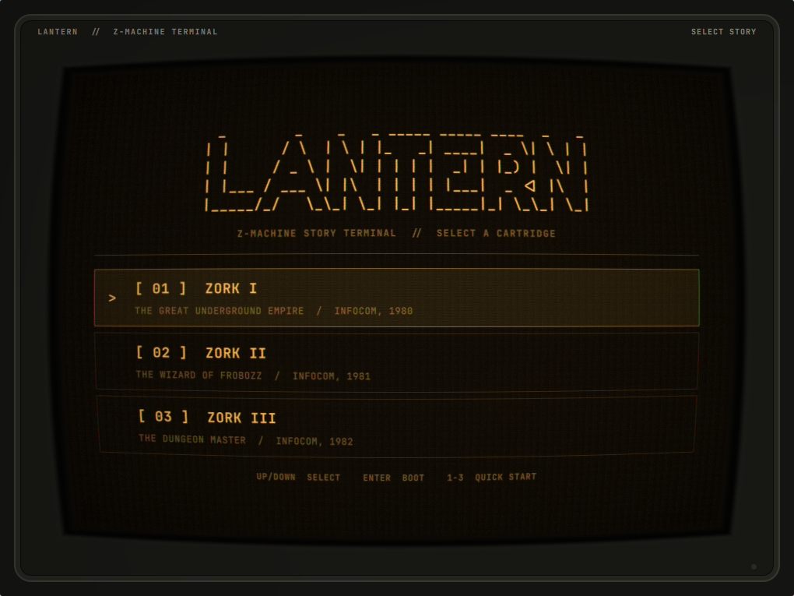

# LANTERN

LANTERN is a standalone Omarchy Quattro plugin for playing Z-machine interactive fiction inside a restrained early-1980s monochrome CRT window.

It is deliberately small: the bundled Frotz interpreter runs the game; LANTERN supplies the panel, phosphor display, command entry, history, and session persistence while the Omarchy shell remains alive.



## Install

```bash
omarchy plugin add https://github.com/OldJobobo/lantern.git --enable
```

That is the complete installation. LANTERN includes its own `dfrotz` runtime and MIT-licensed copies of the complete Zork trilogy. It runs no installer, requests no elevated privileges, downloads no assets on first launch, and requires no separate package.

To uninstall the plugin safely:

```bash
omarchy plugin remove jobo.lantern --yes
```

Saved games and window placement are intentionally retained under `${XDG_STATE_HOME:-~/.local/state}/lantern`. Remove that directory separately only if you also want to erase your saves.

Enabling LANTERN adds its monochrome lantern icon to the right side of the Omarchy bar. It follows the bar foreground while idle; during an active story it shifts to the current theme's `yellow` color and emits a slow phosphor-like pulse. Click it to open or hide the terminal. You can also summon it from the command line:

```bash
omarchy-shell shell summon jobo.lantern '{}'
```

## Platform support

The bundled runtime currently supports **x86-64 glibc Linux**, matching current Omarchy systems. It has no dependencies beyond glibc.

## Games and appearance

LANTERN opens on its cartridge launcher instead of starting a game immediately. The current release includes **Zork I**, **Zork II**, and **Zork III**; choose one with the arrow keys, `Enter`, the matching `1`–`3` key, or a pointer.

For safety, the public summon interface launches only the three bundled cartridges. Arbitrary filesystem paths are rejected before the native Z-machine interpreter is started.

The illustrated RGB button cycles between amber, green phosphor, and an Omarchy-aware mode that uses the active theme's terminal foreground and background colors. Each button press briefly knocks the channels into stacked horizontal slices before they settle into the new palette, like a hardware switcher catching sync. Summon payloads and `lantern.toml` accept `amber`, `green`, or `theme`; the legacy `white` value remains available for compatibility. The CRT shader gives the raster adjustable analog life: content-aware scanline depth, subpixel line weave, bloom between illuminated lines, a slow refresh band, and low-level power flutter. Pass `"effects":false` for an undistorted, motion-free display:

```bash
omarchy-shell shell summon jobo.lantern \
  '{"effects":false,"phosphor":"amber"}'
```

## Configuration

LANTERN ships a documented [`lantern.toml`](lantern.toml) with complete defaults. To create an update-safe personal override, copy it outside the plugin checkout:

```bash
config_root="${XDG_CONFIG_HOME:-$HOME/.config}"
mkdir -p "$config_root/lantern"
cp "$config_root/omarchy/plugins/jobo.lantern/lantern.toml" \
  "$config_root/lantern/lantern.toml"
```

LANTERN polls both files and reloads changes while the Omarchy shell is running. The personal file overrides the bundled defaults. Every mutable configuration and theme path used by the panel or bar widget is read through a 64 KiB bounded native helper that atomically rejects symlinks, non-regular files, and blocking inputs. Available settings cover phosphor color, CRT enablement, BRIGHT dial position and maximum gain, cursor fade timing, command-history and transcript limits, initially selected cartridge, and mouse-wheel dial step. Invalid numeric values are clamped to safe ranges.

## Controls

- **Bar icon:** open or hide LANTERN
- **Drag the top label strip:** move the terminal
- **RGB button:** cycle amber, green-phosphor, and current Omarchy theme colors
- **SCALE button:** cycle the Lantern window independently through 1×, 1.25×, and 1.5×
- **BRIGHT dial:** drag or scroll the illustrated CRT control to adjust the animated raster layer without changing the tube geometry
- **Launcher Up/Down:** select a bundled story
- **Launcher Enter or 1–3:** boot the selected story
- **Game Enter:** submit command
- **Game Up/Down:** command history
- **SAVE button, Ctrl+S, or `SAVE [name]`:** open the Memory Bank and write a named save
- **LOAD button, Ctrl+L, `RESTORE [name]`, or `LOAD [name]`:** select and restore a saved game
- **Game MENU button or Ctrl+M:** end the current story process and return to the cartridge launcher
- **Escape:** hide LANTERN while leaving the game process alive

Closing the native window also preserves the game process. LANTERN rebuilds the `FloatingWindow` on the next bar click so compositor-close and reopen cycles remain reliable.

LANTERN remembers the window's monitor and monitor-relative position when it closes. Before the next window is mapped, it installs a temporary Hyprland initial-placement rule for that saved geometry, then removes the rule after creation. The window therefore starts at its persistent location rather than appearing at center and moving afterward. If the saved monitor is unavailable, the compositor's normal placement is left untouched.

The terminal uses a 1020×765 logical-pixel base calibrated for Frotz's 76-column output. Its SCALE button enlarges that complete surface to 1.25× or 1.5× without changing the rest of the Omarchy shell. Transcript lines never soft-wrap and sit inside a curvature-safe inset so the illustrated tube edge cannot obscure them. The top label strip invokes native window movement. The illustrated bezel, tube well, glass lip, and distorted image share one shader-derived curved edge so the physical frame follows the CRT geometry.

The in-screen **Memory Bank** handles Frotz's filename protocol before sending commands to the interpreter, so prompts without trailing newlines cannot disappear. New saves receive a story-and-timestamp suggestion, names are constrained to safe filename stems, existing saves require overwrite confirmation, and restore presents readable `.qzl` files newest-first. Escape cancels before any interpreter command is sent. Raw Z-machine `SAVE` and `RESTORE` commands are intercepted into the same flow; `LOAD` is accepted as a modern alias for `RESTORE`.

Frotz save and restore access remains restricted to:

```text
${XDG_STATE_HOME:-~/.local/state}/lantern/saves
```

Window geometry is stored separately at:

```text
${XDG_STATE_HOME:-~/.local/state}/lantern/window.json
```

## Bundled third-party software

LANTERN includes:

- Frotz 2.55 `dfrotz`, licensed under GPL-2.0-or-later
- Zork I, II, and III from the corresponding `historicalsource/zork1`, `zork2`, and `zork3` repositories, licensed under MIT

See [`THIRD_PARTY_NOTICES.md`](THIRD_PARTY_NOTICES.md), the complete corresponding Frotz source under `third_party/frotz/source/`, and the checksum inventory at `third_party/SHA256SUMS`.

The original bounded-reader helper has [documented build provenance](docs/read-bounded-file-provenance.md). Its executable is reproducibly built with a digest-pinned GCC container, checksummed alongside its reviewed C source, and rebuilt byte-for-byte in CI.

The repository-level MIT license applies to all original LANTERN code and materials, including its QML, JavaScript, C source, shell scripts, tests, and documentation. It does not relicense bundled third-party components.

## Validation

```bash
./tests/run
./scripts/build-bounded-reader /tmp/read-bounded-file
cmp bin/read-bounded-file /tmp/read-bounded-file
sha256sum -c third_party/SHA256SUMS
./tests/smoke-runtime
omarchy plugin validate .
qmlformat Panel.qml >/dev/null
/usr/lib/qt6/bin/qsb --qt6 -o /tmp/crt.frag.qsb shaders/crt.frag
```

The compiled `shaders/crt.frag.qsb` asset is loaded at runtime; rebuild it with Qt Shader Baker after changing `shaders/crt.frag`.

Static validation is not a substitute for opening the panel in a live Quattro shell. Release verification includes a fresh `omarchy plugin add` installation and live gameplay smoke on Omarchy.

## Development

Quattro installs third-party plugins as ordinary Git checkouts under:

```text
~/.config/omarchy/plugins/jobo.lantern
```

The manifest identity and repository layout must remain compatible with that exact destination.

## License

LANTERN's original code is MIT licensed. See [`LICENSE`](LICENSE). Bundled components retain the licenses listed above.
